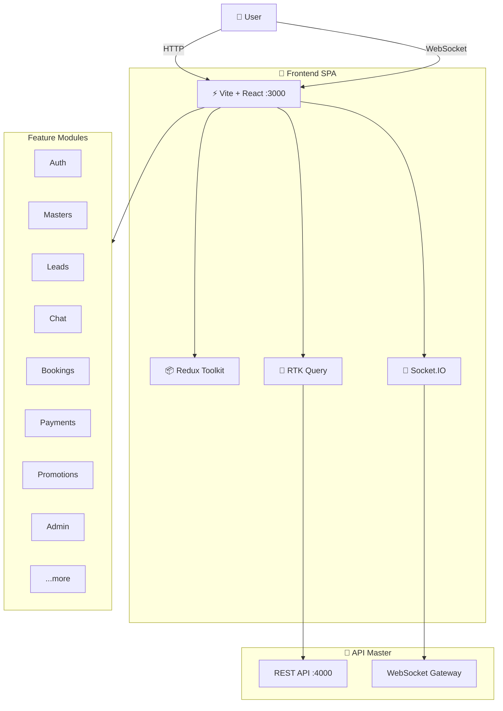

<div align="center">

# 🎨 faber.md Frontend

### Client Application for the Masters Marketplace

**React 19** · **Vite 7** · **TypeScript 5.9** · **Docker**

---

</div>

## 📖 About

faber.md Frontend is a SPA for faber.md marketplace users: clients, masters, and administrators. The application is built on React with a modular architecture, featuring master search, real-time chat, personal dashboards, an admin panel, and multi-language support.

---

## 🛠 Tech Stack

**Core:** Node.js 25 · TypeScript 5.9 · React 19 · Vite 7

**State:** Redux Toolkit · RTK Query · Redux Persist

**Styling:** Tailwind CSS 4 · CSS Modules · Radix UI · Framer Motion

**Real-time:** Socket.IO Client

**Forms & Validation:** React Hook Form · Zod · Yup · Formik

**Routing:** React Router 7

**Internationalization:** i18next · react-i18next

**Maps:** Leaflet · React-Leaflet

**Tests:** Playwright

**CI/CD:** Husky · Docker

---

## 🏗 Architecture



---

## 🚀 Quick Start

### Requirements

- Node.js ≥ 25 and npm ≥ 10
- Docker + Docker Compose (recommended)
- Running API Master (backend)

### Step 1 — Clone

```bash
git clone <repository-url>
cd frontend-master
npm install
```

### Step 2 — Environment Setup

```bash
cp .env.docker.example .env.docker
```

Fill in the variables in `.env.docker` (see [environment variables](#-environment-variables)).

### Step 3 — Run via Docker 🐳

```bash
# Start dev container
docker-compose -f docker-compose.dev.yml up -d --build
```

### Step 4 — Local Run (without Docker)

```bash
npm run dev
```

### Step 5 — Verify

| Service | URL |
|---|---|
| Frontend (Dev) | `http://localhost:3000` |
| Frontend (Prod) | `http://localhost:8080` |

---

## 🔐 Environment Variables

<details>
<summary>🔽 Click to expand full list</summary>

<br>

### Core

| Variable | Required | Description | Default |
|---|:---:|---|---|
| `VITE_API_URL` | ✅ | Base REST URL (with `/api/v1` prefix, as on the backend) | `http://localhost:4000/api/v1` |
| `VITE_WS_URL` | ✅ | WebSocket URL | `ws://localhost:4000` |
| `VITE_ENV` | — | `development` or `production` | `development` |
| `VITE_USE_HTTPONLY` | — | HttpOnly cookies for tokens | `true` |

### CDN (optional)

| Variable | Description |
|---|---|
| `VITE_CDN_BASE_URL` | CDN URL for static assets (Backblaze B2, Cloudflare) |

</details>

---

## 🐳 Docker

### Dev Environment

```bash
npm run docker:up           # Start
npm run docker:down         # Stop
```

| Container | Port | Purpose |
|---|---|---|
| `fabermd-frontend-dev` | 3000 | Vite dev server with hot-reload |

### Prod Environment

```bash
npm run docker:prod:up      # Start
npm run docker:prod:down    # Stop
```

| Container | Port | Purpose |
|---|---|---|
| `fabermd-frontend-prod` | 8080 | Nginx + static build |

### Dockerfile

Multi-stage build:

- **builder** → Vite + TypeScript compilation
- **production** → Nginx Alpine + non-root user + dumb-init + healthcheck
- **development** → Node.js with hot-reload

---

## 📜 NPM Scripts

<details>
<summary>🔽 Development</summary>

| Command | Description |
|---|---|
| `npm run dev` | Start with hot-reload |
| `npm run build` | Production build |
| `npm run preview` | Preview production build |
| `npm run lint` | ESLint |

</details>

<details>
<summary>🔽 Build</summary>

| Command | Description |
|---|---|
| `npm run build` | TypeScript + Vite build |
| `npm run prerender` | Pre-render pages |
| `npm run build:prerender` | Build + Prerender |

</details>

<details>
<summary>🔽 Docker</summary>

| Command | Description |
|---|---|
| `npm run docker:up` | Dev container up |
| `npm run docker:down` | Dev container down |
| `npm run docker:prod:up` | Prod container up |
| `npm run docker:prod:down` | Prod container down |

</details>

<details>
<summary>🔽 Testing</summary>

| Command | Description |
|---|---|
| `npm run e2e` | E2E tests (Playwright) |
| `npm run e2e:api` | API critical flow |
| `npm run e2e:ui` | UI critical flow |
| `npm run e2e:headed` | Run with browser window |

</details>

---

## 📂 Project Structure

```
frontend-master/
│
├── public/                 Static files
│
├── src/
│   ├── main.tsx            Entry point
│   ├── app/                Application configuration
│   │   ├── router.tsx      Routing
│   │   └── store.ts        Redux store
│   ├── components/         UI components
│   │   ├── common/         Shared components
│   │   ├── layout/         Layouts (AppShell, Admin, Dashboard)
│   │   ├── home/           Home page
│   │   ├── notifications/  Notifications
│   │   ├── seo/            SEO
│   │   └── ui/             UI kit (Radix, etc.)
│   ├── features/           Feature modules
│   │   ├── auth/           Authentication
│   │   ├── masters/        Masters (search, map, profiles)
│   │   ├── leads/          Leads
│   │   ├── chat/           Real-time chat
│   │   ├── bookings/       Online booking and scheduling
│   │   ├── reviews/        Reviews and ratings
│   │   ├── payments/       Payments
│   │   ├── promotions/     Promotions and discounts
│   │   ├── favorites/      Favorite masters
│   │   ├── recommendations/ Recommendations
│   │   ├── admin/          Admin panel
│   │   ├── digest/         Digest
│   │   ├── referrals/      Referrals
│   │   ├── socket/         WebSocket
│   │   ├── cookie-consent/ Cookie consent
│   │   └── ...
│   ├── pages/              Pages
│   │   ├── public/         Public pages
│   │   ├── auth/           Authentication
│   │   ├── master/         Master dashboard
│   │   ├── client/         Client dashboard
│   │   ├── admin/          Admin panel
│   │   └── referrals/      Referrals
│   ├── hooks/              Custom hooks
│   ├── services/           API, Socket, env
│   ├── i18n/               Translations
│   ├── types/              TypeScript types
│   ├── utils/              Utilities
│   └── styles/             Global styles
│
├── Dockerfile              Multi-stage
├── docker-compose.dev.yml  Dev stack
├── docker-compose.prod.yml Prod stack
├── nginx.conf              Nginx config (prod)
└── package.json
```

---

## 🧭 Route Map

| Path | Access | Description |
|---|---|---|
| `/` | Public | Home page, master search, promotions |
| `/masters` | Public | Master catalog (filters, map) |
| `/masters/:slug` | Public | Master profile, online booking |
| `/plans` | Public | Pricing plans |
| `/how-it-works` | Public | How the platform works |
| `/faq` | Public | Frequently asked questions |
| `/login` / `/register` | Public | Authentication |
| `/dashboard/*` | Master | Master dashboard (stats, leads, chat, bookings, promotions) |
| `/client/*` | Client | Client dashboard (leads, favorites, chat, bookings) |
| `/admin/*` | Admin | Admin panel |
| `/referrals` | Client | Referral program |

---

## 📁 Key Modules (features)

| Module | Description |
|---|---|
| **auth** | JWT, guards, role-based routes |
| **masters** | Search, cards, profiles, map view |
| **leads** | Client requests |
| **chat** | Real-time chat (Socket.IO) |
| **bookings** | Online booking: slots, schedule, booking management |
| **reviews** | Reviews and ratings |
| **payments** | MIA/MAIB payments |
| **promotions** | Master promotions and discounts (PREMIUM) |
| **recommendations** | Master recommendations |
| **favorites** | Favorite masters (for clients) |
| **admin** | Admin panel |
| **digest** | Digest subscription |
| **referrals** | Referral system |
| **socket** | WebSocket state |
| **cookie-consent** | GDPR cookie consent |

---

## 🚀 Production

### Checklist

- [ ] `VITE_ENV=production`
- [ ] `VITE_API_URL` and `VITE_WS_URL` point to prod API
- [ ] SSL/TLS via reverse proxy (Nginx / Traefik)
- [ ] CDN for static assets (optional)

### Deploy

```bash
# 1. Create prod config
cp .env.docker.example .env
# Fill in VITE_API_URL, VITE_WS_URL

# 2. Start
npm run docker:prod:up
```

---

<div align="center">

© 2026 faber.md Team · All rights reserved

</div>
