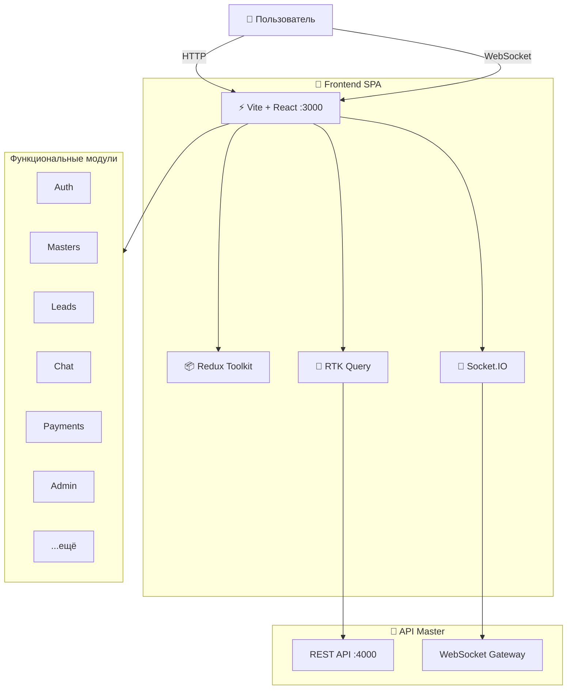

<div align="center">

# 🎨 MasterHub Frontend

### Клиентское приложение маркетплейса мастеров 

**React 19** · **Vite 7** · **TypeScript 5.9** · **Docker**

---

</div>

## 📖 О проекте

MasterHub Frontend — SPA для пользователей маркетплейса MasterHub: клиентов, мастеров и администраторов. Приложение построено на React с модульной архитектурой, включает поиск мастеров, реал-тайм чат, личные кабинеты, админ-панель и мультиязычность.

---

## 🛠 Стек технологий

**Ядро:** Node.js 25 · TypeScript 5.9 · React 19 · Vite 7

**Состояние:** Redux Toolkit · RTK Query · Redux Persist

**Стилизация:** Tailwind CSS 4 · CSS Modules · Radix UI · Framer Motion

**Реал-тайм:** Socket.IO Client

**Формы и валидация:** React Hook Form · Zod · Yup · Formik

**Маршрутизация:** React Router 7

**Интернационализация:** i18next · react-i18next

**Карты:** Leaflet · React-Leaflet

**Тесты:** Playwright

**CI/CD:** Husky · Docker

---

## 🏗 Архитектура



---

## 🚀 Быстрый старт

### Требования

- Node.js ≥ 25 и npm ≥ 10
- Docker + Docker Compose (рекомендуется)
- Запущенный API Master (backend)

### Шаг 1 — Клонирование

```bash
git clone <repository-url>
cd frontend-master
npm install
```

### Шаг 2 — Настройка окружения

```bash
cp .env.docker.example .env.docker
```

Заполните переменные в `.env.docker` (см. [переменные окружения](#-переменные-окружения)).

### Шаг 3 — Запуск через Docker 🐳

```bash
# Поднять dev-контейнер
docker-compose -f docker-compose.dev.yml up -d --build
```

### Шаг 4 — Локальный запуск (без Docker)

```bash
npm run dev
```

### Шаг 5 — Проверка

| Сервис | URL |
|---|---|
| Frontend (Dev) | `http://localhost:3000` |
| Frontend (Prod) | `http://localhost:8080` |

---

## 🔐 Переменные окружения

<details>
<summary>🔽 Нажмите, чтобы развернуть полный список</summary>

<br>

### Основные

| Переменная | Обязательна | Описание | По умолчанию |
|---|:---:|---|---|
| `VITE_API_URL` | ✅ | URL REST API | `http://localhost:4000` |
| `VITE_WS_URL` | ✅ | URL WebSocket | `ws://localhost:4000` |
| `VITE_ENV` | — | `development` или `production` | `development` |
| `VITE_USE_HTTPONLY` | — | HttpOnly cookies для токенов | `true` |

### CDN (опционально)

| Переменная | Описание |
|---|---|
| `VITE_CDN_BASE_URL` | URL CDN для статики (Backblaze B2, Cloudflare) |

</details>

---

## 🐳 Docker

### Dev-окружение

```bash
npm run docker:up           # Поднять
npm run docker:down         # Остановить
```

| Контейнер | Порт | Назначение |
|---|---|---|
| `master-hub-frontend-dev` | 3000 | Vite dev server с hot-reload |

### Prod-окружение

```bash
npm run docker:prod:up      # Поднять
npm run docker:prod:down    # Остановить
```

| Контейнер | Порт | Назначение |
|---|---|---|
| `masterhub-frontend-prod` | 8080 | Nginx + статический билд |

### Dockerfile

Многоступенчатая сборка:

- **builder** → Компиляция Vite + TypeScript
- **production** → Nginx Alpine + non-root user + dumb-init + healthcheck
- **development** → Node.js с hot-reload

---

## 📜 NPM-скрипты

<details>
<summary>🔽 Разработка</summary>

| Команда | Описание |
|---|---|
| `npm run dev` | Запуск с hot-reload |
| `npm run build` | Сборка production |
| `npm run preview` | Превью production-билда |
| `npm run lint` | ESLint |

</details>

<details>
<summary>🔽 Сборка</summary>

| Команда | Описание |
|---|---|
| `npm run build` | TypeScript + Vite build |
| `npm run prerender` | Предрендер страниц |
| `npm run build:prerender` | Build + Prerender |

</details>

<details>
<summary>🔽 Docker</summary>

| Команда | Описание |
|---|---|
| `npm run docker:up` | Dev-контейнер вверх |
| `npm run docker:down` | Dev-контейнер вниз |
| `npm run docker:prod:up` | Prod-контейнер вверх |
| `npm run docker:prod:down` | Prod-контейнер вниз |

</details>

<details>
<summary>🔽 Тестирование</summary>

| Команда | Описание |
|---|---|
| `npm run e2e` | E2E тесты (Playwright) |
| `npm run e2e:api` | API-critical-flow |
| `npm run e2e:ui` | UI-critical-flow |
| `npm run e2e:headed` | Запуск с браузером |

</details>

---

## 📂 Структура проекта

```
frontend-master/
│
├── public/                 Статические файлы
│
├── src/
│   ├── main.tsx            Точка входа
│   ├── app/                Конфигурация приложения
│   │   ├── router.tsx      Маршрутизация
│   │   └── store.ts        Redux store
│   ├── components/         UI-компоненты
│   │   ├── common/         Общие компоненты
│   │   ├── layout/         Layouts (AppShell, Admin, Dashboard)
│   │   ├── home/           Home-страница
│   │   ├── notifications/  Уведомления
│   │   ├── seo/            SEO
│   │   └── ui/             UI-кит (Radix, etc.)
│   ├── features/           Функциональные модули
│   │   ├── auth/           Аутентификация
│   │   ├── masters/        Мастера
│   │   ├── leads/          Заявки
│   │   ├── chat/           Реал-тайм чат
│   │   ├── reviews/        Отзывы
│   │   ├── payments/       Платежи
│   │   ├── admin/          Админ-панель
│   │   ├── digest/         Дайджест
│   │   ├── referrals/      Рефералы
│   │   ├── socket/         WebSocket
│   │   ├── cookie-consent/ Cookie consent
│   │   └── ...
│   ├── pages/              Страницы
│   │   ├── public/         Публичные
│   │   ├── auth/           Авторизация
│   │   ├── master/         Кабинет мастера
│   │   ├── client/         Кабинет клиента
│   │   ├── admin/          Админ-панель
│   │   └── referrals/      Рефералы
│   ├── hooks/              Кастомные хуки
│   ├── services/           API, Socket, env
│   ├── i18n/               Переводы
│   ├── types/              Типы TypeScript
│   ├── utils/              Утилиты
│   └── styles/             Глобальные стили
│
├── Dockerfile              Многоступенчатый
├── docker-compose.dev.yml  Dev-стек
├── docker-compose.prod.yml Prod-стек
├── nginx.conf              Конфиг Nginx (prod)
└── package.json
```

---

## 🧭 Карта маршрутов

| Путь | Доступ | Описание |
|---|---|---|
| `/` | Публичный | Главная и поиск мастеров |
| `/masters/:id` | Публичный | Профиль мастера |
| `/login` / `/register` | Публичный | Авторизация |
| `/dashboard/*` | Мастер | Кабинет мастера (статистика, заявки, чат) |
| `/client/*` | Клиент | Кабинет клиента (заявки, избранное, чат) |
| `/admin/*` | Админ | Админ-панель |
| `/referrals` | Клиент | Реферальная программа |

---

## 📁 Ключевые модули (features)

| Модуль | Описание |
|---|---|
| **auth** | JWT, guards, роуты по ролям |
| **masters** | Поиск, карточки, профили |
| **leads** | Заявки клиентов |
| **chat** | Реал-тайм чат (Socket.IO) |
| **reviews** | Отзывы и рейтинги |
| **payments** | Платежи MIA/MAIB |
| **admin** | Админ-панель |
| **digest** | Подписка на дайджест |
| **referrals** | Реферальная система |
| **socket** | WebSocket состояние |
| **cookie-consent** | GDPR cookie consent |

---

## 🚀 Продакшн

### Чек-лист

- [ ] `VITE_ENV=production`
- [ ] `VITE_API_URL` и `VITE_WS_URL` указывают на prod API
- [ ] SSL/TLS через reverse proxy (Nginx / Traefik)
- [ ] CDN для статики (опционально)

### Деплой

```bash
# 1. Создать prod-конфиг
cp .env.docker.example .env
# Заполнить VITE_API_URL, VITE_WS_URL

# 2. Запустить
npm run docker:prod:up
```

---

<div align="center">

© 2026 MasterHub Team · Все права защищены

</div>
